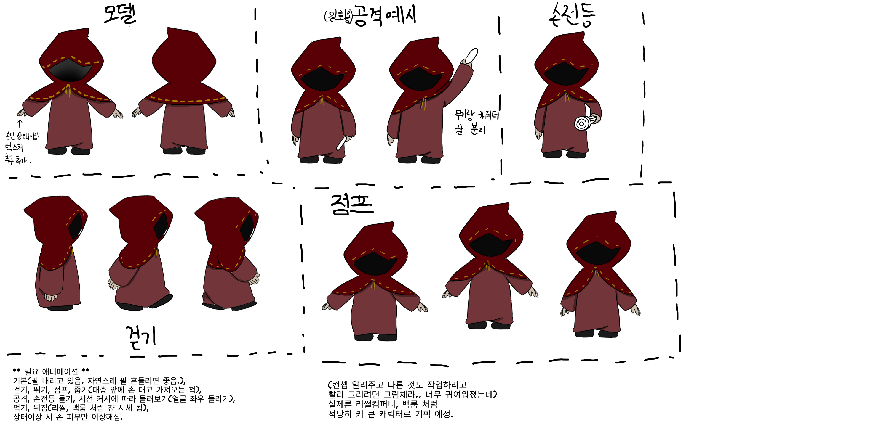

# 📚 비전대 개발팀 [Back Library] 

> **VR 판타지 스토리 생존/탈출 공포게임**  
> 비전대 학생들로부터 팀을 꾸려 개발한  
> 무서버 **P2P 호스트형**으로  
> 처음에는 싱글게임으로 시작하며  
> 추후 밸런스에 따른 멀티까지 계획하고 있습니다.  
> 👉 [개발 노션 바로가기](https://purple-tail-e77.notion.site/2593b9ca5cc980f9a859c17950f10d79?pvs=74)  

  

  <b>백룸</b> 스타일의 무한 루프 맵에서 생존하라.  
  <b>출구 문</b>을 찾아 탈출해야 한다.

  
--- 
  
## 👥 팀 구성 

- ❤️ **클라이언트 개발**  
  - [이승연](https://github.com/SeungYeon04)  
  - 김도경  
  - 유현기  
- 🧡 **3D 모델링**  
  - [문수민](https://github.com/layo429)  
- 💛  **사운드 & BGM제작**
  - 김민혁  
- 💚 **아이디어 기여 & 테스터**  
  - 박지민  
  
--- 
  
## 🛠️ 개발 기술 정보 

- **게임 개발 정보**  
  - 버전: **6000.0.47f1**  
  
- **기술 포인트**  
  - **지원 기기**: VR 전시용 우선 개발 → 추후 PC 플랫폼 확장  
  - **싱글 게임/추후 멀티**: 싱글게임 -> 추후 난이도에 따라 2~5인 멀티 협동 기반 생존/탈출 확장  
  - **무서버 P2P**: 호스트 PC가 세션 주도 → 서버 비용 0원  
  - **게임 콘텐츠**: 체력 아이템 제외 → 열쇠, 퍼즐용 아이템 위주  
  - 전투 시스템 없음 → **공격 불가, 회피와 퍼즐 풀이가 핵심**  
  - **저장 구조**: JSON 로컬 저장 + **Steam Cloud** 동기화  
  
---  
  
## 📖 게임 컨셉 (초기 스토리)  

- **시작 연출**  
  - 플레이어는 계단 위(로비)에서 스폰  
  - 지하 도서관으로 내려가며 튜토리얼 진행 → 지하 도서관 도착  
- **배경 설정**  
  - 우울증으로 피폐해진 사서가 지하에서 문제 많은 책만을 수집하여 보관  
  - 그 결과, 저주의 기운이 가득 모여 있는 지하 도서관이 됨  
- **플레이어 역할**  
  - 비밀단체 조직의 "특정 책의 불안정한 기운을 해결하라"는 의뢰를 받음  
  - 혼자 떨어져있는 이상한 기운의 책에게 다가갔다가 빨려 들어감.  
  - 여러 책 속 세계로 들어가 탐험과 탈출을 반복  
  - "이건 미친 짓이야. 이곳을 나아갸 해!" 하며 탈출구를 찾아다님.  
- **게임 흐름**  
  - 각 책 속 공간에서 퍼즐과 공포 요소를 경험  
  - 문제를 해결하고 출구를 찾아 탈출  
- **몬스터 컨셉**  
  - 일부는 고정 몬스터로 등장  
  - 각 맵마다 책의 망가진 등장인물이 괴물로 변해 출현
- **엔딩 아이디어**  
  - 탈출엔딩: 탈출하여 도망갔다. 하지만 나가는 도중, 조금씩 우는 건지 소리지르는 건지 이명이 들리며 찜찜하다.  
  - 히든엔딩: 한을 풀어주고 탈출하였다. 한을 풀어주는 방법을 찾아 실행하면 다음 맵에서  
  다른 버전의 첫 가든 맵이 나오며 작은 선물을 주고 사용하면 도서관으로 돌아간다.  
  도서관을 나가면 음악과 함께 크레딧이 나온다. [열린 엔딩]  
  
---  
  
## 🎮 플레이 스타일  

- **형태**: 1인칭 VR  
- **진행 목표**  
  - 끝없이 이어지는 공간을 탐험하며 출구를 찾아 탈출  
  - 각 구간마다 다른 퍼즐을 해결해 다음 구역으로 이동  
- **퍼즐 요소**  
  - 버튼/레버 조작  
  - 열쇠 획득 및 사용 (그 외 아이템X)  
  - 힌트 확인 후 풀이 (예: 포스트잇, 낙서 등 환경 힌트)  
- **위험 요소**  
  - 몬스터는 특정 구간마다만 출현  
  - 퍼즐 실패 시 위협 기믹 발동  
  - 점프스퀘어(갑작스러운 등장)로 공포 연출  
- **전투/아이템**  
  - 체력 아이템 제외  
  - 퀵슬롯은 열쇠·퍼즐용 아이템 위주  
  - 전투 시스템 없음 → 공격 불가, **회피와 퍼즐 풀이가 핵심**  
- **연출 효과**  
  - 괴물 근처에서 노이즈, 심장 박동 등의 긴장감 이벤트  
  - 시각/청각 효과로 몰입감 강화
- **조작 문제**  
  - 달리기: 조이스틱 클릭 어려우니, 기본 이속 높이기
  - 점프: 멀미 문제로 전시 때는 연결X (시각, 달팽이관 정보 다르면 멀미)  
- **베타**
  - 베타씬: 화면 하얘지며 크레딧 나오고 베타입니다 뜨기  
  
---  
  
## 🌍️ 맵 컨셉 

### 도서관마다의 장르 

[문학, 인문, 자기계발, 경제/경영, 가정/취미, 의학/건강, 여행/지리, 과학/기술, 사회과학, 종교, 역사/문화, 인물/평전 등, 판타지, SF(과학 소설), 추리, 로맨스, 무협, 공포, 시, 희곡, 수필, 만화책, 동화책]  
이번까진 봐줬는데 가면 갈 수록 쎄짐  
백설공주 나오다가 개쎈놈 나오고  
  
1. 의뢰 받은 도서관  
    
2.  
> - 도서관코드: 099.99 (정상 범위를 넘은 번호. 도서관 분류 체계에서 벗어난 비정상 자료)  
> - 맵: 폐쇄된(창문 없는) 유토피아 실내 정원  
> - 몹: 빨간 색의 눈만 보이는 알 수 없는 괴물(박쥐 모티브:길 안 따라가고 가까이가면 죽음)  
> - 컨셉: 도서관 사서가 평생을 바쳐 여기를 지켰지만  
> 버려진 지하 도서관에 대한 정으로 자의로 갇혔고  
> 우울증이 걸린 상태에서 상상 속을 살며  
> 직접 쓴 등록되지 않은 자신만의 유토피아 공간으로  
> 다른 책으로 넘어가도록 길을 강요함.  
> 000~900 코드상 한바퀴 돌며 한 풀면 여기 오고, 못 풀면 막맵에서 도서관으로 바로 탈출됨.  
> - 목표: 아름답지만 어둡고 이어진 길만 빛남. 들어오자마자 우와 할 분위기  
  
3.  
> - 도서관코드: 130 (초자연학·심령학)  
> - 맵: 검붉은 색상의 나무 미로 속, 강령술 흔적(주술진, 피 묻은 문양, 봉인된 의식실).  
> 주술진 중 한 곳에서 몬스터 소환 됨. 주변 촛불이 켜져있을 때, 주술진을 밟으면 죽음.
> - 몹: 악마, 타락괴물, 눈깔괴물 중으로 ㄱㄱ + 몬스터는 주술진을 크게 싹 돌아다님.  
> - 드롭템: 빠루(나무판자 부숴서 개구멍 열 수 있음), 열쇠  
> - 힌트: 개구멍 앉기(X?)해서 들어가면 괴물이 못 본다. 열쇠를 찾아 사슬+자물쇠로 막힌 문을 열어 탈출구로 간다.  
  
4.  
> - 도서관코드: 155 (차이심리학 및 개인심리학 / 개인 성격, 감정, 기질 등)
> - 맵: 평온한 연한 분홍→갑자기 어두운 자주색으로 전환 (안정→혼란)  
> 부드러운 라벤더→갑자기 짙은 회색으로 전환 (평화→침묵과 불안)  
> 건강한 연두색 벽→돌연 병색 초록으로 변함 (생명→부패)  
> 중립 회색→선명한 붉은색 벽면으로 바뀜 (무감각→위협)  
> 벽으로 이어진 미로 속 색배치로만 공포감 조성 + 어두운 색상의 공간은 좁아짐 + 숨은 몬스터
> - 목표: 색상의 변화로 공포감 조성 + 리미널 스페이스 버전  
  
5.  
> - 도서관코드: 171 (트롤리 딜레마 / 일반 윤리학 이론)
> - 맵: 색깔 블록으로 쌓여있는 장난감 맵 (예시: 키즈카페, 토이스토리 감성)
> 장난감 기차가 기찻길을 지나가는데  
> 왼쪽에는 토끼 인형 3마리와, 오른쪽에는 오리 인형 1마리가 있음.  
> 레버를 당기면 둘 중 하나는 밟고 지나감. (인형 밟힐 때의 소리와 함께)  
> 그러므로 기찻길을 주워 끊긴 중간 기찻길을 연결해주면  
> 기차가 서서히 사라지며, 다음 스페이지 문이 열린다.
> - 몹: 왼쪽 철로를 밟을 때마다 바로 토끼괴물이 나왔다 사라지고
> 오른쪽 철로를 밟을 때마다 바로 오리괴물이 나왔다 사라짐  
> - 힌트: 인형이 밟힐 시기마다, 베개 동굴 속에 앉기(X?)를 눌러서 들어가있기  
> - 목표: 밝은 분위기에서 트롤리 딜레마를 모방하여 인위적인 분위기를 나타냄.  
  
6.  
> - 도서관코드: 178 (환경 윤리)  
> - 맵: 완전히 까맣게 변한 물 위  
> 마을의 건물들은 대부분 잠겨 있다.  
> 배를 타고 마을의 끝으로 가서  
> 빛이 보이는, 비상문을 향해 탈출해야 한다.
> - 몹: 방사능으로 형체가 망가진 하늘의 괴물 (원래는 갈매기? 였던 것.)  
> - 목표: 환경이 망가진 검정색 물로 가득 채운다.  
> 쓰레기랑 담배꽁초라도 띄워야 하나?  
   
7.
8. 
9. 

10. 
11. 
12. 

13. 
14. 
15. 

16. 
17. 
18. 

19. 
20. 
21. 

22. 
23. 
24. 

25. 
26. 
27. 

28. 
29. 

동화/잔혹동화 패러디 : 티비 속 실내로 강철과 끊어진 전선들이 나돌며, 빛이 있다.  
상호작용 아이템: 은도끼, 금도끼(스폰: 막힌 나무 문을 부술 수 있다.)  
탈출미션: 피 묻은 토끼인형을 주워 바다로 던지면 다 같이 그 위로 올라옴. 탈출구 데려다줌.  

<!-- 
100    심리학 / 철학    동화책 옆에 가까울 수 있음 (인간 내면 탐구)    어린아이 심리 실험 기록, 이상한 꿈 이야기
  200 은 사이비년들 종교물건 새로 만들어서(타종교안겹치게 분위기만 내던.. 로브입은 천사악마 섞어 넣던) 쫓아오게 넣어주자 
200    종교    살짝 떨어져 있음    고서의 성경, 이단 경전, 의식을 묘사한 그림책
300    사회과학    비교적 멀리    고아원 기록, 인권 침해 보고서, 실종자 명단
500    자연과학    중간    비정상적인 생물학 문서, 곰팡이/기생충 도감
600    의학/기술    동화책에서 멀리 떨어져 있음    실험 노트, 절단 해부도, 병원 도서
700    예술    문학 근처일 수 있음    왜곡된 초상화, 피로 칠한 그림책
800    문학 (동화, 시 포함)    동화책 위치 — 중심 or 초입부    무서운 삽화가 갑자기 바뀌는 동화책, 누군가 낙서한 이야기책
900    역사/지리    문학과 가까울 수도 있음    사라진 마을의 연대기, 전쟁 속 아동 실종 기록
-->
  
### 🎮 플레이어 정보 

#### 플레이어의 스탯 

- 스탯  
  - HP: 서서히 회복되는 구조, **원콤 없음**  
- 퀵슬롯  
  - 4칸, 퍼즐용 열쇠나 상호 아이템 줍는 용도  
  
#### 플레이어의 형태 

승연 메디방 컨셉아트

  

  
### 몬스터 정보 

체력 깎는 몹 & 상태이상 몹  
  
<!--

### 보류된 아이디어 

딱히 쓸 곳 없는 귀속 전리품이나 그냥 전리품  
모아서 어려운 맵에서 존재하는  
거리를 배회하는 상호작용 되는 귀신 NPC  
다른 괴물처럼 소리내고 위험 이벤트가 일어나던 하고  
몹이 먼저 공격하진 않지만  
먼저 때리면 무섭게 달려옴
  
## 🕯️ 이스터에그(스포 일부)

- **속삭임의 실**  
  - 희귀하게 맵의 **장롱**에서 사람 형태의 귀신 등장  
  - 상호작용 시 손가락에 **빨간 실 반지**(생명 연결)  
  - 이후 **속삭임** 지속, **가위**로 실을 자르면 침묵  
  - (변이 상태에서는 소리 유지, **자막**으로 의미 표기 고려)
- **인형 장신구**  
  - 착용 시 **멘탈 감소 딜레이** 부여(앵무새 마스코트풍)  
--> 
  
## 참고 자료 

게임: 백룸, 레포, 리썰, 살육의 천사, 호미사이퍼  
웹툰: 통제구역관리부, 상봉 서고에서 만나요!  
  
## 📜 저작권

- 팀원분들의 포트폴리오용으로 열어두었습니다.  
개발기간 동안의 참고자료와 과정물이 함께 담겨있는 곳이므로 소중한 자원일 수 있습니다.
  
자료와 과정을 참고하는 것은 좋은 것이지만  
저와 팀원들의 자료를 사용할 경우
출처는 꼭 남겨주시길 바랍니다.  

> 📚 비전대 개발팀 [Back Library] 
