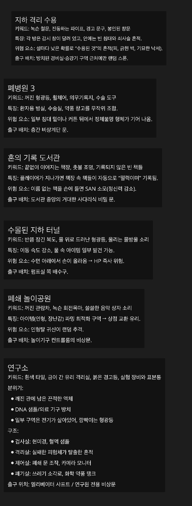

# 🎮 3D 멀티 공포게임

> **비전대 개발팀** · 4–5인 협동 생존/탈출 · 무서버 **P2P 호스트형**

  

  <b>백룸</b> 스타일의 무한 루프 맵에서 생존하라.  
  <b>랜덤 위치의 출구 문</b>을 찾아 팀원과 함께 탈출해야 한다.

  
---

### ✨ 기술 포인트

- **4–5인 멀티**: 협동 기반 생존/탈출  
- **무서버 P2P**: 호스트 PC가 세션 주도 → 서버 비용 0원  
- **인벤토리/퀵슬롯**: 장비 1개 + 퀵슬롯 2개  
- **저장 구조**: JSON 로컬 저장 + **Steam Cloud** 동기화  
  
### 게임 개발 정보 

버전 : 6000.0.47f1  
  
### 게임의 스토리 컨셉 

장르: 협동 공포 탈출 ? 게임  
  
시작할 때 스폰포인트로 해서 로비에서 지하로 내려가게 하고  
튜토리얼처럼 지하 도서관까지 내려가도록 하며 시작.  
  
우울증으로 피폐한 세계에 미쳐있는 사서가  
너무 문제가 많은 책들로 버려진 책만을 수집하여  
안 좋은 기운이 가득히 모여있는 지하 도서관  
그 중 저주의 기운이 가득한 책의 기운이 커져  
그걸 해결하라는 의뢰를 받은 플레이어  
그렇게 여러 책들 속으로 들어가고 계속  
랜덤 위치로 나오는 문을 타고 책 속을 거닐며,  
문제를 해결하고 탈출을 해야 하는 컨셉  
  
고정 몬스터와, 맵별 몬스터는 책의 망가진 등장인물로써 등장  
  
### 맵 컨셉 

#### 초기 맵 아이디어 리스트 

수민 맵 컨셉 아이디어

  
  
컨셉 참고용 사진이며, 내부 내용은 미정확. 리드미 참고  
지하 도서관, 도서관 확장 버전 맵과  
그 외 폐병원, 연구소, 놀이동산 등 적용될 예정.  
  
### 아이템 컨셉 

게임 요소를 방해하지 않는 선에서  
손전등: 특정 몹에게 빛을 비춰 눈과 맞으면 딜레이  
일회용 화학폭탄: 연구소에서 흘러온 일회성 폭탄(빡센 연구소에 많음.)  
  
### 형태와 효과 

- 형태: 1인칭  
괴물이 근처에 있을 때  
노이즈나 심장소리 등의 이벤트 필요  
- 야외 맵: 야외 맵 자체가 난이도가 높은 맵. 낮밤마다 몹 특징 변경  
- 죽음: 아이템 잃어버림.  
- 스폰: 특정 맵에 따라 스폰될 때 손전등 몇 개 주기도 함.  
(가끔 있음. 굳이 손전등 없어도 클리어는 가능함. 있으면 밝다.)  
  
### 플레이어 정보 

#### 플레이어의 스탯 

- 스태미너  
(걷기, 멈춤: 스태미너 회복, 뛰기: 스태미너 달기, 점프: 스태미너 멈춤  
점프가 짧고 속도가속이 작고 방향전환이 X 백룸과 비슷한 조작.)  
- 멘탈  
(도서관에서는 정신력 안닮고, 모든 맵에서 조금씩 닮.  
몬스터가 가까우면 빨리 닮.)  
- HP 게이지  
(원콤도 있고, 아이템 신경X 자동회복만)  
  
#### 플레이어의 형태 

승연 메디방 컨셉아트

  
    
### 몬스터 정보 

원콤 즉사 몹 & 상태이상 몹  
  
### 보류된 아이디어 

딱히 쓸 곳 없는 귀속 전리품이나 그냥 전리품  
모아서 어려운 맵에서 존재하는  
거리를 배회하는 상호작용 되는 귀신 NPC  
다른 괴물처럼 소리내고 위험 이벤트가 일어나던 하고  
몹이 먼저 공격하진 않지만  
먼저 때리면 무섭게 달려옴
  
--- 
  
<!--
## 🕯️ 이스터에그(스포 일부)

- **속삭임의 실**  
  - 희귀하게 맵의 **장롱**에서 사람 형태의 귀신 등장  
  - 상호작용 시 손가락에 **빨간 실 반지**(생명 연결)  
  - 이후 **속삭임** 지속, **가위**로 실을 자르면 침묵  
  - (변이 상태에서는 소리 유지, **자막**으로 의미 표기 고려)
- **인형 장신구**  
  - 착용 시 **멘탈 감소 딜레이** 부여(앵무새 마스코트풍)  
--> 
  
## 👥 팀

| 이름 | 역할 |
|---|---|
| [이승연](https://github.com/SeungYeon04) | 클라이언트 개발 |
| [김도경] | 클라이언트 개발 |
| [유현기] | 클라이언트 개발 |
| [김민혁] | 사운드 |
| [최영석] | QA |
| [김희경] | UI/UX 디자인 |
| [문수민](https://github.com/layo429) | 3D 모델링 |

> 개발자는 자기 깃허브 계정 달고, 그 외엔 자기 포폴 페이지나 SNS URL 달아도 됨.  
  
## 개발과정 

[Notion 링크](https://purple-tail-e77.notion.site/2593b9ca5cc980f9a859c17950f10d79?pvs=74)  
  
## 참고 자료 

게임: 백룸, 레포, 리썰, 살육의 천사, 호미사이퍼  
웹툰: 통제구역관리부, 상봉 서고에서 만나요!  
  
## 📜 저작권

- 팀원분들의 포트폴리오용으로 열어두었습니다.  
개발기간 동안의 참고자료와 과정물이 함께 담겨있는 곳이므로  
팀원들이 직접 만든 자료들은 출처를 꼭 남겨주시길 바랍니다.  
